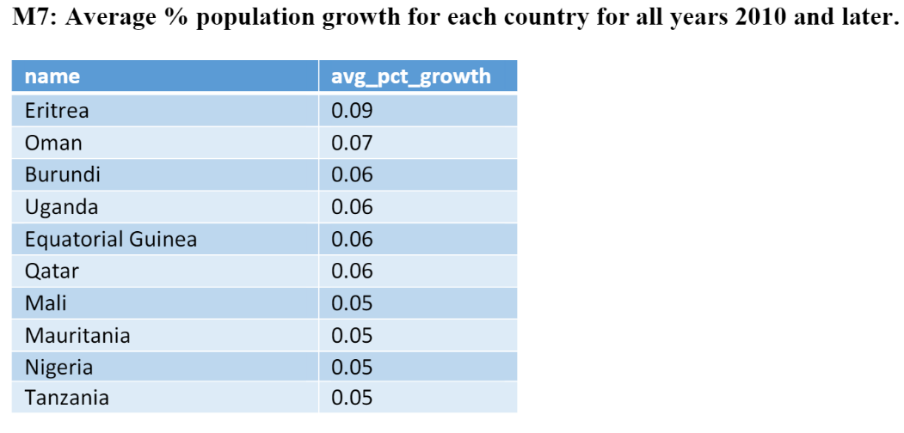
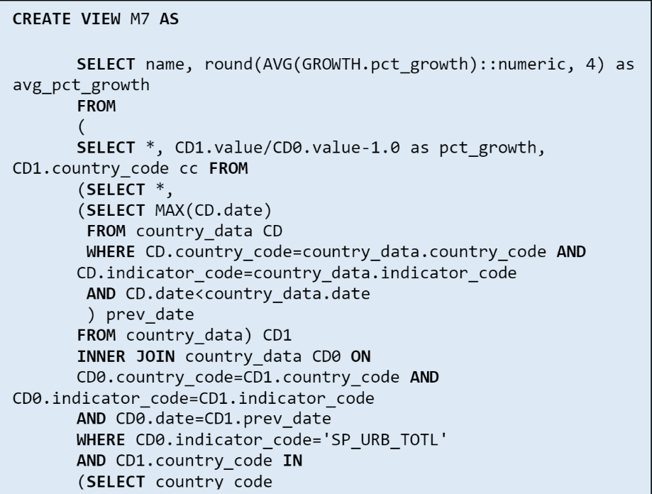

# World Bank Database and Population Analysis With PostgreSQL

A database containing global population data from [The World Bank](https://data.worldbank.org/). Features 213 countries with data spanning 
from 1950 to 2018 for 10 unique population indicators. [Supplemental Analysis](population_queries.pdf) is provided with an SQL appendix to showcase examples 
of powerful answers that can be queried and visualized with this database. Model is normalized to reflect real-life relationships between
countries and continents and enforce standardized naming procedures. 

Population Indicators:
- EN_URB_LCTY = population in largest city (1960-2018)
- SP_POP_TOTL = population, total (1950-2018)
- SP_URB_TOTL = Urban Population (1950-2018)
- SP_URB_GROW = Urban population growth (annual %) (1951-2018)
- SM_POP_NETM = Net migration (1952-2017)
- IS_AIR_PSGR = Air transport, passengers carried
- NY_GDP_MKTP_CD = GDP (current US$)
- NY_GDP_PCAP_CD = GDP per capita (current US$)
- SH_MED_BEDS_ZS = Hospital beds (per 1,000 people)
- FP_CPI_TOTL_ZG = Inflation, consumer prices (annual %)
- IT_NET_USER_P2 = Internet users (per 100 people)

## Packages Used
PostgreSQL 14
- SQL

## ERD

ERD showcases the relationships between the five entities in the WDI Database. "Continent_country" is
an associative entity containing a list of countries for each continent. "Country_data" is the main
associate entity that contains a list of each country's indicator value, with date as the 
primary key. 

## Normalization 

Initial database was an attempt to combine World Bank indicators with continent data. The attempt created
anomalies such as unknown character codes, unmatched records, and duplicates that were highlighted through the 
use of [join queries](https://github.com/mgcruz024/wdi-population/blob/e7a261c1dcc20e592732467678e5840eccb088f3/main.sql#L145). Database became 
normalized by enforcing referential integrity in accordance with the ERD and updating/deleting/insertion methods. 

## Analysis

WDI Database allows for the execution of complex, Type I, and Type II nested queries that deliver
[tangible answers to questions](population_queries.pdf) pertaining to the global population. With the many indicators available,
questions such as the M7 example above can be answered. M7 uses a nested query to calculate the average
population % growth for all countries since 2010 and sort them in descending order.

## Maintenance

[Improved](Maintenance/wdi_db_maintenance.sql) the performance of retrieval queries while limiting any significant increases
to the database storage. 

Created a two-column index: "ix_country_data_country_code_indicator_code" that boosted query performance by 7.5 seconds while 
only adding 194MB to the main "country_data" table.

## Notes
Data retrieved from https://data.worldbank.org/
